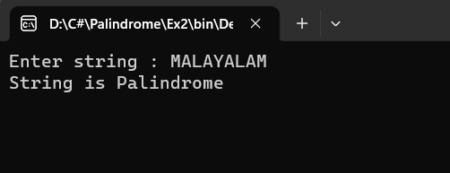

# Palindrome

## Aim:
To write a C# program to find whether the given string is a Palindrome or not.
## Algorithm:
1. Start the program
2. Ask the user to enter a string.
3. Read the string from the console.
4. Loop over the entire string and reverse it.
5. Use if condition to check whether the string and the reversed string is equal or not.
6. print palindrome if it's equal else print not a palindrome.
7. End the program.
## Program:
```
NAME : SUDHARSHNA LAKSHMI S
REGISTER NO : 212221230110
```
```
using System;
namespace palindrome
{
    class Program
    {
        static void Main(string[] args)
        {
            string s, revs = "";
            Console.Write("Enter string : ");
            s = Console.ReadLine();
            for (int i = s.Length - 1; i >= 0; i--) //String Reverse  
            {
                revs += s[i].ToString();
            }
            if (revs == s) // Checking whether string is palindrome or not  
            {
                Console.WriteLine("String is Palindrome");
            }
            else
            {
                Console.WriteLine("String is not Palindrome");
            }
            Console.ReadKey();
        }
    }
}
```

## Output:
### PALINDROME

### NOT A PALINDROME


## Result:
Thus the C# program to display whether the given string is Palindrome or not is executed successfully.
